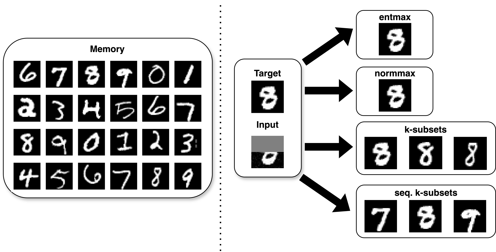

# Hopfield-Fenchel-Young Networks: A Unified Framework for Associative Memory Retrieval
Official implementation of the paper **Hopfield-Fenchel-Young Networks: A Unified Framework for Associative Memory Retrieval**.

*Saul Santos*, *Vlad Niculae*, *Daniel McNamee* and *André Martins*

<p align="center">
  
</p>
**Abstract**: *Associative memory models, such as Hopfield networks and their modern variants, have garnered renewed interest due to advancements in memory capacity and connections with self-attention in transformers. In this work, we introduce a unified framework—Hopfield- Fenchel-Young networks—which generalizes these models to a broader family of energy functions. Our energies are formulated as the difference between two Fenchel-Young losses: one, parameterized by a generalized entropy, defines the Hopfield scoring mechanism, while the other applies a post-transformation to the Hopfield output. By utilizing Tsallis and norm entropies, we derive end-to-end differentiable update rules that enable sparse transformations, uncovering new connections between loss margins, sparsity, and exact retrieval of single memory patterns. We further extend this framework to structured Hopfield networks using the SparseMAP transformation, allowing the retrieval of pattern associations rather than a single pattern. Our framework unifies and extends traditional and modern Hopfield networks and provides an energy minimization perspective for widely used post-transformations like ℓ<sub>2</sub>-normalization and layer normalization—all through suitable choices of Fenchel-Young losses and by using convex analysis as a building block. Finally, we validate our Hopfield-Fenchel-Young networks across diverse memory recall tasks, including free and sequential recall. Experiments on simulated data, image retrieval, multiple instance learning, and text rationalization demonstrate the effectiveness of our approach.*

----------

**If you use this code in your work, please cite our paper.**

----------

## Resources

- [Paper](https://arxiv.org/abs/2411.08590) (arXiv)

All material is made available under the MIT license. You can **use, redistribute, and adapt** the material for **non-commercial purposes**, as long as you give appropriate credit by **citing our paper** and **indicating any changes** that you've made.


## Synthetic, MNIST and Multiple Instance Learning Experiments
### Python requirements and installation

This code was tested on `Python 3.10.10`. To install, follow these steps:

1. In a virtual environment, first install Cython: `pip install cython`
2. Clone the [Eigen](https://gitlab.com/libeigen/eigen.git) repository to the main folder: `git clone git@gitlab.com:libeigen/eigen.git`
3. Clone the [LP-SparseMAP](https://github.com/nunonmg/lp-sparsemap) fork repository to main folder, and follow the installation instructions found there
4. Install the requirements: `pip install -r requirements.txt`
5. Run the corresponding scripts

### Reproducibility
#### Memory Retrieval Modeling

Run the script `memory_retrieval_modeling.py`

#### Image Retrieval
Run the script `ME_plotting.py`

#### MNIST MIL
Run the script `MNIST_bags.py` with the desired parameters (nomenclature can be found in the beginning of the script)

#### Benchmarks MIL

Download and upzip the dataset

```bash
$ wget http://www.cs.columbia.edu/~andrews/mil/data/MIL-Data-2002-Musk-Corel-Trec9-MATLAB.tgz 
```

Run the script `MIL_Data_2002.py` with the desired parameters (nomenclature can be found in the beginning of the script)

#### Countours and Basins of Attraction
Run the scripts `countours.py` and `basins.py` 

#### Metastable State Counting
Run the script `MNIST_metastable.py`

## Spectra Experiments
### Python requirements and installation
Follow the instructions of the branch in [hopfield-spectra](https://github.com/deep-spin/spectra-rationalization/tree/hopfield-spectra)

## Acknowledgment

The experiments in this work benefit from the following open-source codes:
* Saul Santos, Vlad Niculae, Daniel C McNamee, and Andre F.T. Martins. Sparse and structured hopfield networks. In International Conference on Machine Learning, 2024. https://github.com/deep-spin/SSHN
* Ramsauer, Hubert, Bernhard Schäfl, Johannes Lehner, Philipp Seidl, Michael Widrich, Thomas Adler, Lukas Gruber et al. "Hopfield networks is all you need." arXiv preprint arXiv:2008.02217 (2020). https://github.com/ml-jku/hopfield-layers
* Martins, Andre, and Ramon Astudillo. "From softmax to sparsemax: A sparse model of attention and multi-label classification." In International conference on machine learning, pp. 1614-1623. PMLR, 2016. https://github.com/deep-spin/entmax
* Correia, Gonçalo M., Vlad Niculae, and André FT Martins. "Adaptively sparse transformers." arXiv preprint arXiv:1909.00015 (2019). https://github.com/deep-spin/entmax
* Peters, Ben; Niculae, Vlad; Martins, André FT. "Sparse Sequence-to-Sequence Models." In Proceedings of ACL, 2019. [Online] Available: https://www.aclweb.org/anthology/P19-1146.  https://github.com/deep-spin/entmax
* Guerreiro, N. M. and Martins, A. F. T. Spectra: Sparse structured text rationalization. In Proceedings of the 2021 Conference on Empirical Methods in Natural Language Processing, pp. 6534–6550, 2021. https://github.com/deep-spin/spectra-rationalization/tree/hopfield-spectra
* Ilse, Maximilian, Jakub Tomczak, and Max Welling. "Attention-based deep multiple instance learning." In International conference on machine learning, pp. 2127-2136. PMLR, 2018. https://github.com/AMLab-Amsterdam/AttentionDeepMIL

